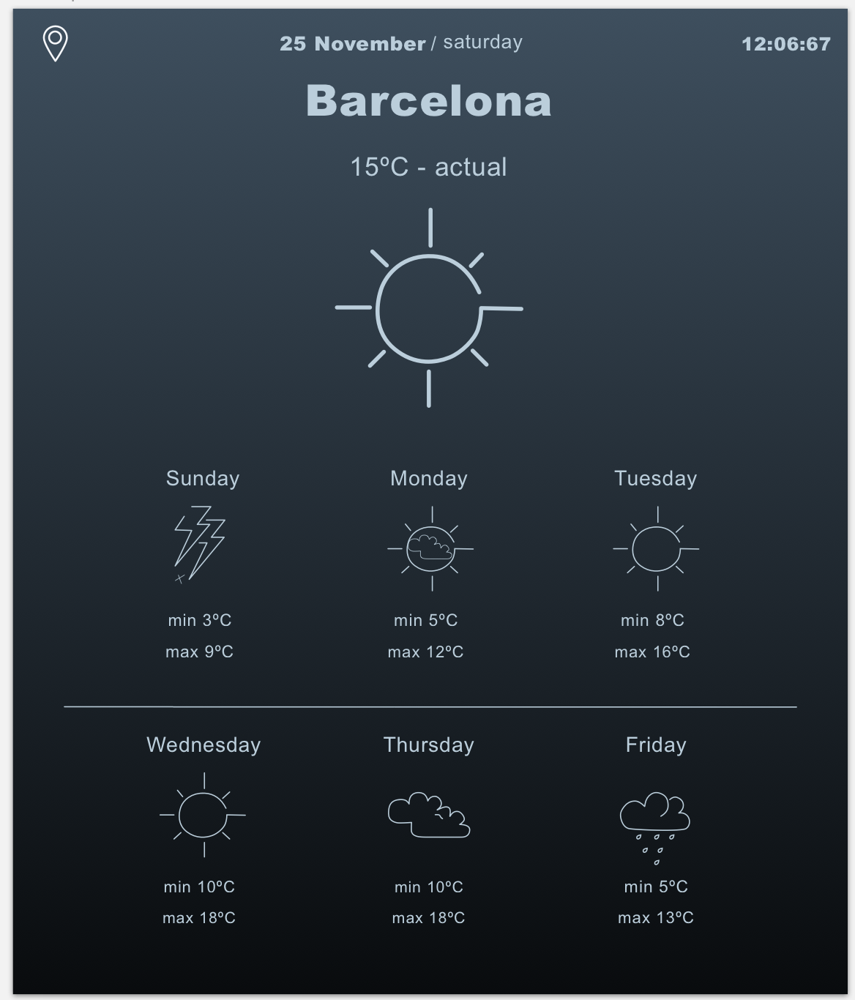
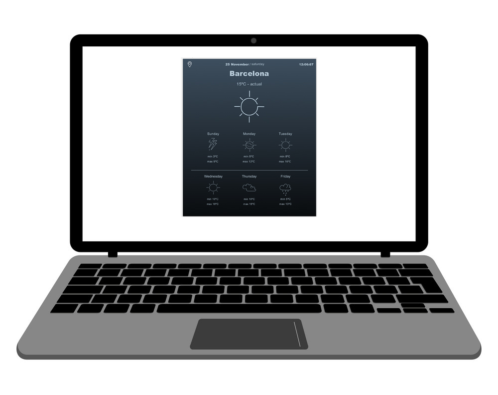

# Lights out coding challenge

**Without checking you page in the browser** write HTML and CSS code to clone this one. 

The goal of this approach is to think through the structure and approach first and then start coding.

Make it limited width as for mobile devices, let's say 600px would be fine (as in the second picture ↓↓↓). No need for media queries. 

Once done, see the final results in your browser and be amazed! 

